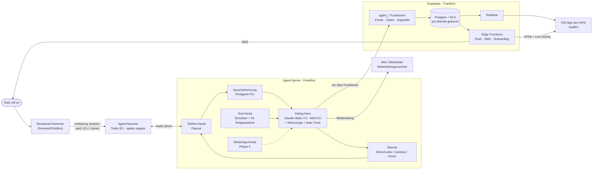
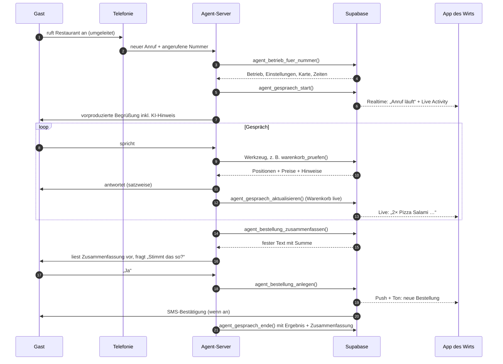

# Architektur

Stand 01.10.2026, Phase 0. Annahme: Bauweise A (eigene Kaskade) wie in
`phase-0-stack.md` empfohlen — noch nicht von Ibo entschieden.

## Das Bild

## Die fünf Grundsätze

1. **Der Kern kennt keinen Kanal.** Er bekommt Text, gibt Text und
   Werkzeug-Aufrufe zurück. Telefon, Simulator und WhatsApp sind dünne
   Hüllen darum. Darum testen die 20+ Testgespräche wirklich das, was am
   Telefon läuft.
2. **Das Sprachmodell entscheidet, die Datenbank rechnet.** Werkzeuge wie
   `warenkorb_pruefen` geben Preise, Pflichtauswahl und Fehler zurück. Das
   Modell darf nur Gerichte in den Warenkorb legen, die es per ID aus der
   Karte hat. Die Schluss-Zusammenfassung ist ein **fester Text aus der
   Datenbank**, den die Stimme wörtlich vorliest.
3. **Pflichtsätze sind Code, nicht Prompt.** KI-Hinweis am Anfang,
   Rückfrage bei Adresse/Telefonnummer, Bestätigung vor dem Speichern —
   diese Schritte erzwingt der Kern als Zustände, nicht als Bitte im Prompt.
4. **Jeder Fehler hat einen Ausgang.** Was auch kaputtgeht: der Gast hört
   nie Stille und bekommt nie eine falsche Zusage (Tabelle unten).
5. **Der Agent-Server hat keinen Direktzugriff auf Tabellen.** Nur die
   `agent_*`-Funktionen in der Datenbank — die prüfen Betrieb,
   Öffnungszeit, Preise und Kapazität selbst.

## Ein Anruf, Schritt für Schritt

## Wann geht der Agent ran? Zwei Wege

| | **Weg 1: Umleitung beim Restaurant** | Weg 2: Wir steuern |
|---|---|---|
| Wie | Das Restaurant stellt in FritzBox/Telekom ein: bei besetzt, nach X Sekunden oder immer → Agent-Nummer | Das Restaurant leitet *immer* um. Wir lassen erst eine zweite Restaurant-Nummer X Sekunden klingeln, dann übernimmt der Agent |
| App-Einstellung „immer / Überlauf / Zeiten“ | wirkt nur teilweise (Umleitung liegt beim Restaurant) | wirkt voll |
| Risiko | sehr gering — Umleitung aus = alles wie vorher | höher — fällt unser Server aus, hängt die Leitung an uns |
| Kosten | Umleitung zahlt das Restaurant | zusätzlich unsere abgehenden Minuten |

**Vorschlag:** Pilot mit **Weg 1**. Die Notbremse ist dann ein Schalter in
der FritzBox, den der Wirt kennt. Weg 2 ist ein späteres Upgrade; die
Datenbank sieht ihn schon vor (`answer_mode`).

**Weiterleitung an einen Menschen:** Sie geht an eine eigene
Weiterleitungsnummer (Handy des Wirts oder zweite Leitung) — **nie zurück
auf die Hauptnummer**, sonst landet der Anruf wieder beim Agenten.
Weitergeleitete Anrufe werden markiert; kommt so einer erneut an, gibt es
keine zweite Weiterleitung, sondern eine Rückrufbitte.

## Was passiert, wenn etwas kaputtgeht

| Ausfall | Was der Gast erlebt | Was der Wirt sieht |
|---|---|---|
| Agent-Server weg | Twilio spielt die Ersatz-Ansage und leitet an die Weiterleitungsnummer (Fallback-URL beim Anbieter) | Push „Agent nicht erreichbar“ |
| Supabase weg | „Ich nehme Ihre Nummer auf, wir rufen zurück“ — Rückrufbitte wird auf dem Server zwischengespeichert und nachgereicht | Rückrufbitte erscheint, sobald Supabase zurück ist |
| Spracherkennung / Stimme / Modell weg | Umschalten auf Ersatz-Anbieter; sonst Rückrufbitte | Eintrag im Fehlerprotokoll mit Anruf-ID |
| Gast versteht man nicht (3× nachgefragt) | Angebot: Weiterleitung oder Rückruf | Anruf mit Ergebnis „Rückruf“ |
| außerhalb der Öffnungszeit | sagt Öffnungszeiten, nimmt keine Bestellung an, bietet Reservierung für später | Anruf mit Ergebnis „Frage“ |
| Küche pausiert („keine Bestellungen“) | „Gerade nehmen wir keine Bestellungen an, ab 19:30 wieder“ — Reservierungen gehen weiter | Pausenknopf zeigt Restzeit |

Eine **Wache** prüft den echten Weg: alle 15 Minuten ein Textgespräch durch
den Kern gegen den Testbetrieb (kostenlos), einmal pro Stunde (10–22 Uhr)
ein echter Testanruf (~1 Min). Die Meldungen folgen der Ruhe-Regel aus der
Kiek-mol-in-`CLAUDE.md` (erstes Mal sofort, danach still, Entwarnung genau
einmal).

## iOS-App

- **SwiftUI, MVVM, Swift Concurrency**, Supabase Swift SDK v2.
- Mindest-iOS 26 (Vorschlag E4), gebaut und getestet mit Xcode 27 /
  iOS-27-Simulator.
- **Realtime** für Bestellungen, Reservierungen, laufende Anrufe.
- **Push:** neue Bestellung als *Time Sensitive* (braucht keine
  Apple-Freigabe). *Critical Alerts* sind laut Apple für Gesundheit und
  Sicherheit — für Küchen-Bestellungen wohl nicht zu bekommen.
- **Live Activity** für den laufenden Anruf: per Push gestartet (ab
  iOS 17.2), höchstens 8 Stunden, 4 KB Daten, Update-Budget von Apple nicht
  veröffentlicht.
- **Bondrucker (Phase 5):** Epson TM-m30III kann kein AirPrint →
  Star-SDK/Epson-ePOS-SDK; Bluetooth-MFi-Drucker brauchen eine
  Registrierung beim Hersteller (~1–2 Wochen). Star CloudPRNT druckt direkt
  vom Server, ganz ohne iPhone — für die Küche vermutlich das Robusteste.
- **Große Flächen, Dark Mode, iPad:** Mindestgröße für Knöpfe 60 pt statt
  Apples 44 pt (nasse Hände). Listen auf dem iPad als zwei Spalten.

## WhatsApp (Phase 4, jetzt nur vorbereitet)

- Datenbank: die Tabelle heißt `conversations` (nicht `calls`) und hat
  eine Spalte `channel` — ein WhatsApp-Chat ist ein Gespräch wie ein Anruf.
- Server: der Kern ist textbasiert; WhatsApp wird ein dritter Kanal neben
  Telefon und Simulator.
- Bestätigungen laufen über eine Tabelle `messages` mit `channel` (`sms`
  heute, `whatsapp` später).
